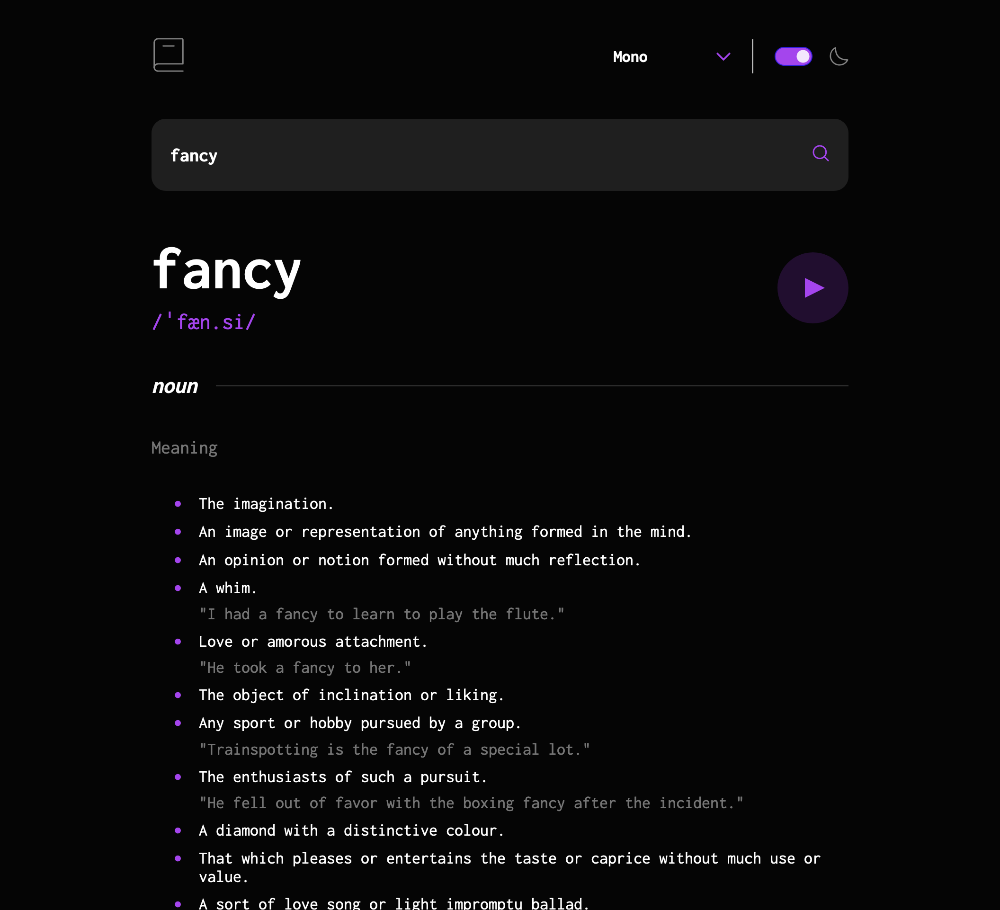

# Frontend Mentor - Dictionary web app solution

This is a solution to the [Dictionary web app challenge on Frontend Mentor](https://www.frontendmentor.io/challenges/dictionary-web-app-h5wwnyuKFL). Frontend Mentor challenges help you improve your coding skills by building realistic projects. 

## Table of contents

- [Overview](#overview)
  - [The challenge](#the-challenge)
  - [Screenshot](#screenshot)
  - [Links](#links)
- [My process](#my-process)
  - [Built with](#built-with)
  - [What I learned](#what-i-learned)
  - [Continued development](#continued-development)
- [Author](#author)
- [Acknowledgments](#acknowledgments)

**Note: Delete this note and update the table of contents based on what sections you keep.**

## Overview

### The challenge

Users should be able to:

- Search for words using the input field
- See the Free Dictionary API's response for the searched word
- See a form validation message when trying to submit a blank form
- Play the audio file for a word when it's available
- Switch between serif, sans serif, and monospace fonts
- Switch between light and dark themes
- View the optimal layout for the interface depending on their device's screen size
- See hover and focus states for all interactive elements on the page
- **Bonus**: Have the correct color scheme chosen for them based on their computer preferences. _Hint_: Research `prefers-color-scheme` in CSS.

### Screenshot



### Links

- Solution URL: [Dictionary Web App in React, CoreUI, SCSS](https://www.frontendmentor.io/solutions/dictionary-web-app-in-react-coreui-scss-N9tGP4WpLf)
- Live Site URL: [Dictionary Web App](https://mightycoyote.github.io/dictionary-web-app)

## My process

### Built with

- Semantic HTML5 markup
- Flexbox
- Mobile-first workflow
- SCSS
- Fluid typography: no media queries except to set darkmode preference on first visit
- [React](https://reactjs.org/)
- [new-component utility](https://github.com/joshwcomeau/new-component)
- [CoreUI](https://coreui.io/)

### What I learned

This was the second React project I've done so far, and the first time I've used a UI library for one of my own projects. I mainly wanted the library for the darkmode "switch" component, but I used the CoreUI components for most of the other UI elements as well. It was also helpful for the font selector, because CoreUI had already done the work to replace the the native down arrow with a custom one. I replaced their replacement with the purple one from this design, and made further adjustments:

```scss
#fontselect {
  font-family: inherit;
  font-size: $c14-to-18;
  font-weight: 700;
  color: inherit;
  background-color: inherit;
  border: none;
  /* replaces CoreUI's custom caret with the one for this design */
  background-image: url(./assets/images/icon-arrow-down.svg);
  padding-top: 0;
  padding-bottom: 0;
  padding-right: 46px;
  cursor: pointer;

  &:focus {
    border: 1px solid $purple;
    box-shadow: none;
    outline: none;
  }
}
```

I also started this project with [CSS Modules](https://create-react-app.dev/docs/adding-a-css-modules-stylesheet/) for the first time as well, since in React it's best practice to pair components with their CSS rather than having a giant stylesheet. Unfortunately it didn't play well with CoreUI. If I were working on a full design system for an ongoing project, I would have worked out alternate tooling (a different UI library, [styled-components](https://styled-components.com/)?), but for this, I moved the CSS into a giant stylesheet and added Sass both to match the CoreUI stylesheets and make it easier to read.

The Free Dictionary API results are fairly complex, depending on how many definitions there are for any given word. The JS code had to map everything that was a definition, as well as handle synonyms, antonyms (the design didn't specify whether to include antonyms, but I did), and examples used in a sentence. 

The app is also supposed to play a recording of the word, when one is available, but in the data it can be attached to any, several, or none of the phonetic (IPA) pronuciations. This code takes a section of the data returned and searches through it for audio:

```jsx
function PlayWord({ wordInfo }) {
  // URL or null
  const [audioFile, setAudioFile] = React.useState(null);
  const audioRef = React.useRef();

  // find a phonetics entry that includes audio
  React.useEffect(() => {
    const audioSifted = wordInfo.phonetics.find((audio) => audio.audio !== "");
    setAudioFile(audioSifted !== null ? audioSifted?.audio : null);
  }, [wordInfo.phonetics]);

  return (); //etc.
}
```

The darkmode component checks for user preference, but also saves a preference locally if they set it. Someone's preference for _this_ page will take precedence over general system settings. In addition, clicking anywhere on the component (like the moon icon) will activate the switch. The font setting is also saved locally. Here are the state settings at the app's top level:

```jsx
  // looks for local prefs
  const [font, setFont] = React.useState(() => {
    const savedPref = localStorage.getItem("dictionaryFont");
    return savedPref ?? "sanserif";
  });
  // also system prefs for this one
  const [darkmodeOn, setDarkmodeOn] = React.useState(() => {
    const userPref =
      JSON.parse(localStorage.getItem("dictionaryDarkmode")) ??
      window.matchMedia("(prefers-color-scheme: dark)").matches;
    return userPref;
  }):
```

### Continued development

The design spec for this project includes a completely customized select component for the font chooser. I spent some time looking into this, and found that not only does it require handbuilding a new select UI element, doing so is fraught with accessibility problems. I ran out of time I could devote to this project to take it on, for now. (In the same way, I would have left this element for last had I been doing this project for a client or employer, since it's the most time-consuming and risky part of the design.)

## Author

- Website - [Sarah Wilkes](https://mightycoyote.github.io/)
- Frontend Mentor - [@mightycoyote](https://www.frontendmentor.io/profile/mightycoyote)
- Mastodon - [@mightycoyote@horrorhub.club](https://horrorhub.club/@mightycoyote)

## Acknowledgments

I adapted the CSS for the horizontal line after each part of speech from [this CodePen by Dan Rigsby](https://codepen.io/danrigsby/pen/waOOvw).

[Thudfactor](https://social.horrorhub.club/@thudfactor) helped me resolve a couple of puzzling bugs (and my Macbook Pro remains undefenestrated for one more day).
